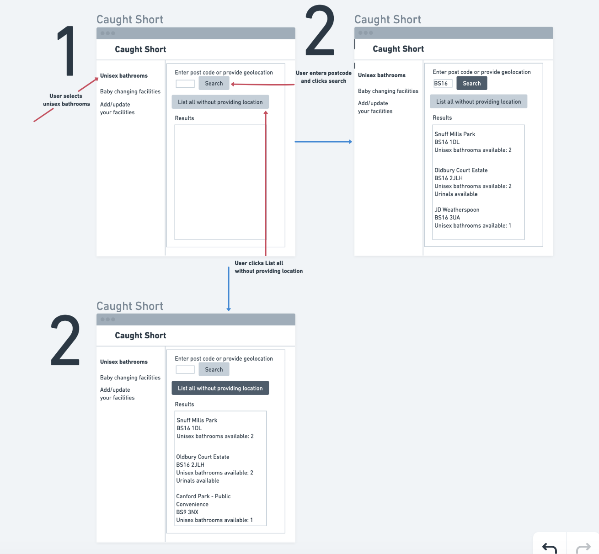
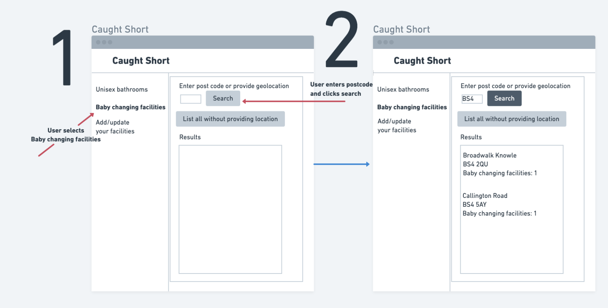
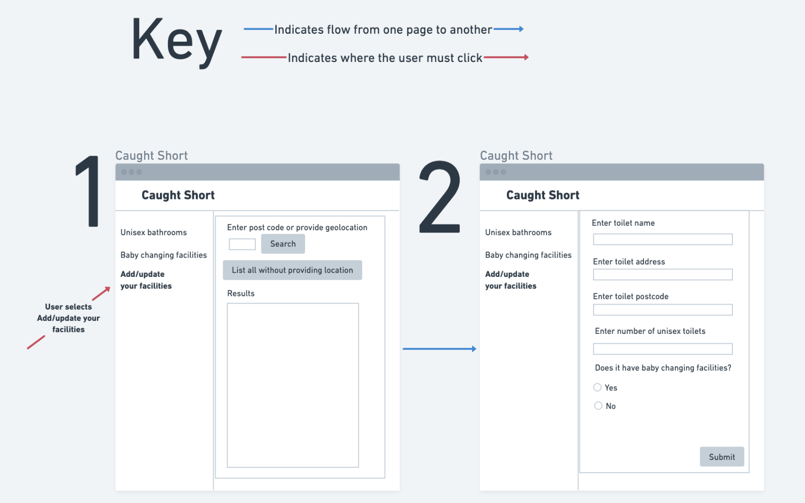

# Design

Our app design will be simplistic and user-friendly. The information will clearly be displayed on the left-hand side, allowing users to filter their search for toilets with a simple click of a button (or in this case, a word such as "Unisex Bathrooms"). The user will be able to filter based on 3 of the following options: "Unisex bathrooms," "Baby changing facilities," and "Add/update your facilities."

We will also implement a way for the user to search for toilets based on their current postcode, clearly indicated by a text box with the prompt "Enter postcode," with a search button next to it. The user will simply be able to search all facilities by clicking a button underneath that clearly states "List all without providing location."

Finally, we will implement a page where community toilet providers, such as pubs and restaurants, can provide their information so that Bristol Open Data can further update its dataset on toilets and allow users to find more convenient options in the future.

## User Interface design

