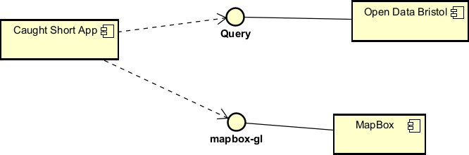

# Implementation

## Introduction
The dataset contains information about public toilet locations in Bristol. It has the following information for each toilet:

- OBJECTID: A unique identifier for each entry.
- TOILET_NAME: The name of the toilet facility.
- ADDRESS: The location/address of the toilet.
- LOCATION: The general area or location where the toilet is situated.
- POSTCODE: The postal code for the location.
- OPENING_HOURS: The operating hours of the toilet facility.
- MALE, FEMALE, DISABLED, BABY_CHANGE: Indicated with (Y/N) whether the toilet offers these features.
- ATTENDED: Whether the toilet is attended by staff, indicated by (Y/N).
- OWNED_TYPE: Indicates whether the toilet is publicly or privately owned.
- X, Y: Coordinates given for mapping the location.

We have the following known issues with out dataset:

- Outdated or incomplete information: Some toilets are marked as "currently closed," (e.g. "Currently CLOSED for maintenance" or "Currently CLOSED due to vandalism"). We have no understanding of when these toilets will be open again and whether they will be updated on the data set.

- Data gaps: There are some missing or incomplete data entries, with certain features (e.g. No indication of whether baby change facilities are available at some toielts).

- Operating Hours: The "Opening Hours" doesn't follow one set format, some toilets provide specific times, while others provide more general information (e.g. "Open 24 hours").

- Removal of datasets: Half way through our implementation phase our origianl data set was removed from Brisol Open data. Our orginal set had significantly more toilets, which would've benefitted the user with their selection. We have now had to make do with a vastly smaller data set.

Configuration data:

- Geospatial Data: The coordinates (X, Y) allow for easy implementation into mapping systems.

- Operational Data: The dataset uses a mixture of free-text descriptions (for hours and closures) and categorical Y/N responses (for available facilities). This makes it flexible but may also introduce inconsistencies in data formatting.

## Project Structure
TODO: provide a table listing the number of jslint warnings/reports for each module.

Our project folder is organised into three main areas. The first area includes the HTML, CSS, and JavaScript files, which are easily accessible for quick startup of the Caught Short Web App. The second area consists of two separate folders:

"docs" - This folder contains all our markdown files, documenting our methodology throughout the design, planning, requirements, implementation, and testing phases.

"pictures" - This folder holds wireframes and use case diagrams, providing a centralized location for visual resources.


Each file has the following role:

<br> docs:	Contains documentation files related to the project, including design, implementation, planning, requirements, and testing.
<br> design.md:	A file that outlines the design of the website and showcases out wireframes.
<br> implementation.md:	A file that details how the website is implemented, including architectural choices, and any challenges encountered.
<br> planning.md:	A Markdown file that includes our business case and our options considered to resolve the problem at hand.
<br> requirements.md:	A Markdown file outlining functional and non-functional requirements and our use case diagrams.
<br> testing.md: A Markdown file that discusses the testing strategy for the web app including types of tests and testing results.
<br> add-update.html:	A HTML file for adding or updating new toilet information, the user will submit their toilets to be included in the dataset.
<br> index.html: The main entry point of the website or web application. This is the landing page or the page users are first directed to when they visit the site.
<br> mobile.css: A CSS file containing styles specific for mobile devices, ensuring responsive design and good user experience on small screens.
<br> script.js:	A JavaScript file that contains the functionality of the map and location gathering, as well as the add/update functionality.
<br> style.css:	A CSS file containing the overall styles for the website, including fonts, colors, layout, and other visual elements.
<br> table.js: A JavaScript file that handles the functionality of the table. Pulling data from the Bristol Open Data API and dynamically rendering it.
<br> toilet_favicon.png: An image file used as the favicon for the website, shown in the browser tab.

# JSLint warnings table for script.js

| #  | Issue Description | Code Example |
|----|------------------|--------------|
| 1 | Unexpected 'let'. | `for (let i = 0; i < features.length; i++) {` |
| 2 | Move variable declaration to top of function or script. | `var map = new mapboxgl.Map({` |
| 3 | Expected property 'center' to be ordered before property 'style'. | `center: [-2.587910, 51.454514],` |
| 4 | Unexpected trailing space. | `zoom: 14 ` |
| 5 | Expected 'var' and instead saw 'let'. | `let features = json.features;` |
| 6 | Unexpected 'for'. | `for (let i = 0; i < features.length; i++) {` |
| 7 | Console error. | `console.error('Error fetching geocode:', error);` |
| 8 | Alert error. | `alert('Error finding location');` |


# JSLint warnings table for table.js
| #  | Issue Description | Code Example | Recommended Fix |
|----|------------------|--------------|-----------------|
| **1** | Unexpected 'var' | ```js<br>for (var i = 0; i < items.length; i++) {<br>}``` | Replace with `let`:<br>```js<br>for (let i = 0; i < items.length; i++) {<br>}``` |
| **2** | Property ordering | ```js<br>fetch(url, { method: "GET", headers: { Accept: "application/json" } })``` | Alphabetize properties:<br>```js<br>fetch(url, { headers: { Accept: "application/json" }, method: "GET" })``` |
| **3** | Unexpected 'for' | ```js<br>for (var i = 0; i < items.length; i++) {<br>}``` | Use array methods:<br>```js<br>items.forEach((item, i) => {<br>  // code<br>});``` |


## Software Architecture
Our application pulls from Bristol Open Data API and dynamically generates a table using the response. It also makes use of Mapbox to provide a visual map.



## Bristol Open Data API
TODO: Document each query to Bristol Open Data


TODO: Repeat as necessary

# User guide
TODO: Explain how each use-case works by providing step-by-step screenshots for each use-case. This should be based on a tested scenario.
