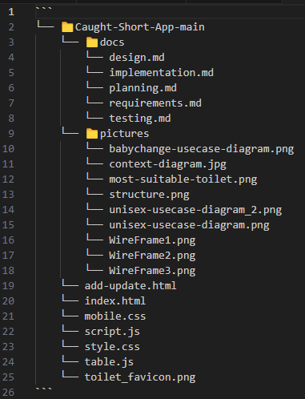

# Implementation

## Introduction
The dataset contains information about public toilet locations in Bristol. It has the following information for each toilet:

- OBJECTID: A unique identifier for each entry.
- TOILET_NAME: The name of the toilet facility.
- ADDRESS: The location/address of the toilet.
- LOCATION: The general area or location where the toilet is situated.
- POSTCODE: The postal code for the location.
- OPENING_HOURS: The operating hours of the toilet facility.
- MALE, FEMALE, DISABLED, BABY_CHANGE: Indicated with (Y/N) whether the toilet offers these features.
- ATTENDED: Whether the toilet is attended by staff, indicated by (Y/N).
- OWNED_TYPE: Indicates whether the toilet is publicly or privately owned.
- X, Y: Coordinates given for mapping the location.

We have the following known issues with out dataset:

- Outdated or incomplete information: Some toilets are marked as "currently closed," (e.g. "Currently CLOSED for maintenance" or "Currently CLOSED due to vandalism"). We have no understanding of when these toilets will be open again and whether they will be updated on the data set.

- Data gaps: There are some missing or incomplete data entries, with certain features (e.g. No indication of whether baby change facilities are available at some toielts).

- Operating Hours: The "Opening Hours" doesn't follow one set format, some toilets provide specific times, while others provide more general information (e.g. "Open 24 hours").

- Removal of datasets: Half way through our implementation phase our origianl data set was removed from Brisol Open data. Our orginal set had significantly more toilets, which would've benefitted the user with their selection. We have now had to make do with a vastly smaller data set.

Configuration data:

- Geospatial Data: The coordinates (X, Y) allow for easy implementation into mapping systems.

- Operational Data: The dataset uses a mixture of free-text descriptions (for hours and closures) and categorical Y/N responses (for available facilities). This makes it flexible but may also introduce inconsistencies in data formatting.

## Project Structure
TODO: Provide an outline of the project folder structure and the role of each file within it.
provide a table listing the number of jslint warnings/reports for each module.

Our project folder is broken down into 3 main areas, We have out html, css and js files on display and without a folder for easy access to enable quick start up of the Caught Short Web App. We then have two seperate folders, "docs" which contains all of our md work which shows our methodology during the design, planning, requirements, implementation and testing phases. The other folder is titled "pictures" which contails out wire frames and Use case diagrams in one useful location.

## Software Architecture
TODO: Describe the major components of your architecture. Are any particular architectural styles being used?

## Bristol Open Data API
TODO: Document each query to Bristol Open Data

TODO: Repeat as necessary

# User guide
TODO: Explain how each use-case works by providing step-by-step screenshots for each use-case. This should be based on a tested scenario.
