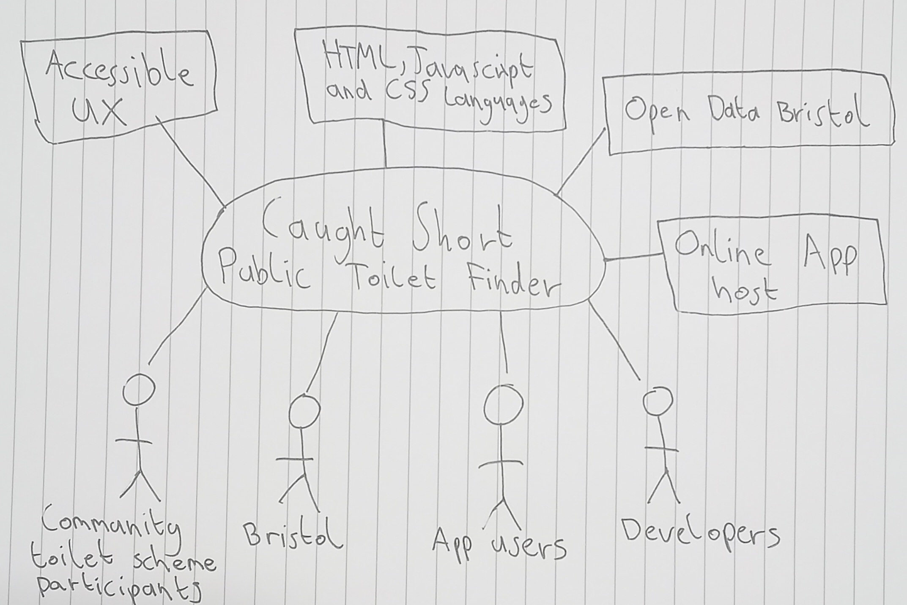

# Project Proposal

## Business Case

### Problem statement
We aim to develop a streamlined app that enables users to quickly locate the nearest community toilet based on their individual needs. Our focus is on directing users to free-access facilities to reduce public urination and disorderly conduct. Additionally, the app will allow users to filter options such as baby-changing facilities or availability of urinals.

### Business benefits
Convenience: Users can quickly find the nearest community toilet, reducing the stress and urgency associated with locating a restroom.

Reduced Public Disorder: By directing users to available toilets, the app can help decrease incidents of public urination and other forms of disorderly conduct.

Accessibility: The app can highlight free-access toilets, ensuring that users have options without the need to make a purchase.

Customisation: Users can filter searches based on specific needs, such as baby-changing facilities or gender-specific restrooms, enhancing user experience.

Tourism Enhancement: For travelers, the app can serve as a valuable resource, making it easier to navigate new areas without the anxiety of finding a restroom.

Data Collection: The app can gather data on toilet usage patterns, helping local authorities identify areas in need of more facilities or maintenance.

Emergency Situations: In urgent situations, having a reliable source to find the nearest toilet can be crucial for users, providing peace of mind whilst in a public space.

### Options Considered

Bristol.gov.uk contains a map that lists all the available toilets. These can be selected to access information about the specific location. There is however no way to search by specific needs, eg. a list of all the unisex bathrooms.

Google maps can provide you with some locations of public toilets but it is not always accurate and again does not have a filter option for your specific needs.

Flush is a great bathroom locator app that works all over the world. At the time of writing, there are more than 190,000 separate public bathrooms and toilets listed. However our app will focus on Bristol only making it more accurate and reliable.

### Expected Risks

Dependancy on technology: As it is an interactive map, it may be problematic for users with older devices or those using poor internet connections.

Privacy Concerns: The app may collect location data and user information, raising potential privacy issues. Users might be hesitant to share their location due to fears of being tracked or having their data misused.

Inaccurate Information: The app relies on user-generated content and external data sources, which may lead to inaccuracies in toilet availability or conditions. This could frustrate users and undermine trust in the app.

Vandalism and Misuse: Public toilets may be subject to vandalism or misuse, which could deter users from utilising the facilities. The app may inadvertently direct users to poorly maintained or unsafe locations.

Overcrowding: Increased awareness of available toilets could lead to overcrowding at certain facilities, potentially causing inconvenience for users.

Limited Coverage: In areas with fewer community toilets, the app may not provide sufficient options, leading to user dissatisfaction.

Negative User Experience: If the app fails to meet user expectations or experiences technical issues, it could lead to negative reviews and decreased usage.

## Project Scope
Key Features

Location-Based Search: Utilise GPS to identify and display the nearest public bathrooms in real-time.

Filter Options: Allow users to filter searches based on specific needs, such as baby-changing facilities, gender-specific restrooms, and accessibility features.

User Ratings and Reviews: Enable users to rate and review facilities, providing insights into cleanliness and overall experience.

Interactive Map: Integrate an interactive map that shows the locations of nearby toilets. Then link those locations to googlemaps to allow users to navigate their way to them.

Community Contributions: Allow users to add new locations and update existing information, fostering a community-driven approach to maintaining accurate data. WHich will be screened by an admin.

User-Friendly Interface: Design an intuitive and accessible interface that caters to a wide range of users, including those with disabilities.

