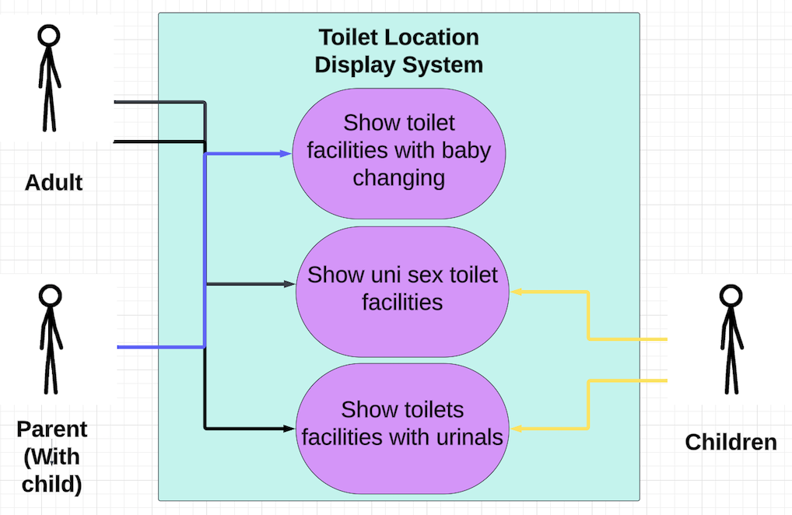
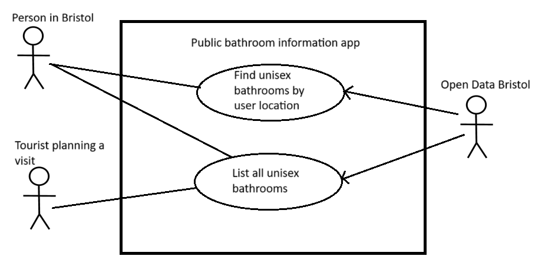
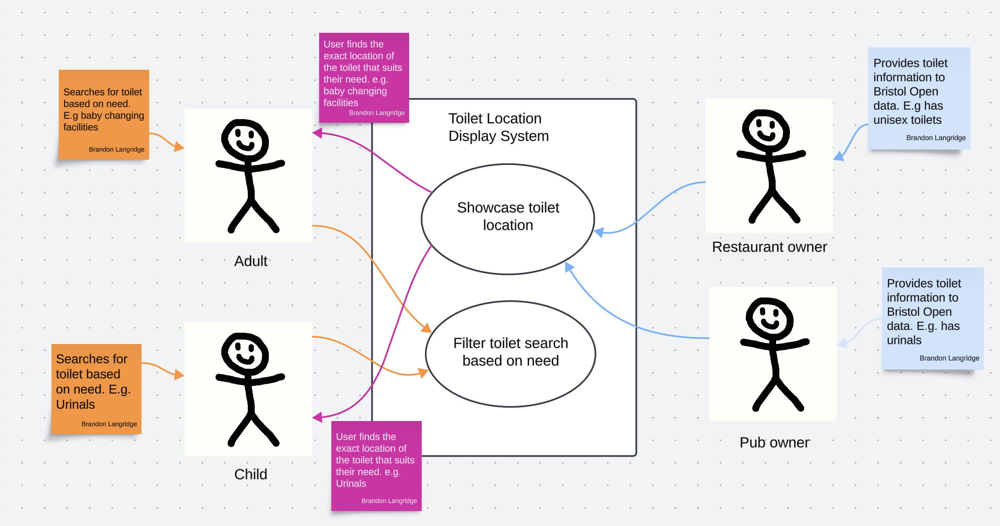

# Requirements

## User Needs

### User stories
As a person in Bristol I want to find a nearby public toilet that suits my needs so that I am able to relieve myself and continue with my day.

As a parent I need to know where I can access baby changing facilities when out in Bristol.

### Actors
* People of all genders will benefit by finding a toilet that suits their personal needs.

* Parents (with a baby) will benefit by finding toilets with baby changing facilities.

* Children will benefit by being able to find a safe location for a toilet in a public space.    

### Use Cases

| UC1 | Find all baby changing facilities in Bristol | 
| -------------------------------------- | ------------------- |
| **Team Member** | Brandon |
| **Description** | Find baby changing facilities via Bristol Open Data and Geo-location |
| **Actors** | Parents (with a baby) that require baby changing facilities |
| **Assumptions** | We have enough data to pull from Bristol Open Data and Google maps to aide navigation |
| **Steps** | User will filter their search to look for facilities with baby changing capability. The system will provide a list of the closest facilities with accurate distances and locations on a spot map. User will copy and paste location from the system into Google maps to navigate to the available facility |
| **Variations** | The user could navigate their way to the facility without copying and pasting the location into Google maps if they know the area well or they can use the spot map effectively |
| **Non-functional** | The system should provide up to date available facilities, The facilities accurate location and the distance from the user to them  |
| **Issues** | Showing the location of the facilities on a spot map |

Use-case 1:

| UC2| Find unisex bathrooms| 
| -------------------------------------- | ------------------- |
| **Team Member** | Graham |
| **Description** | Enable users to find unisex public bathrooms, either as a total list across Bristol or by the user's location |
| **Actors** | People in Bristol. Potential tourists planning a visit. |
| **Assumptions** | We have a database of unisex bathrooms and their location and the ability to acquire a user's location.
| **Steps** | User may provide their location data to the app and request information on nearest unisex bathrooms. The Open Data Bristol database shall be searched for bathrooms that are both unisex and near the user's location and the results shall be presented to the user. Alternatively user may request list of all unisex bathrooms without providing location.  |
| **Variations** | There may be no unisex bathrooms near the user's location. The user will be informed that this is the case. |
| **Non-functional** | The list presented to the user should be easily read by a person of average vision. |
| **Issues** |  |

| UC3| Find most suitable toilet| 
| -------------------------------------- | ------------------- |
| **Team Member** | Brandon |
| **Description** | Enable restaurant owners and pub owners to add value to the app by providing infomation on the facilities they have. |
| **Actors** | Retaurant and pub owners as well as people (the users) in Bristol.|
| **Assumptions** | We have a database of bathrooms and their location and the ability to acquire the user's location.
| **Steps** | User may provide their location data to the app and request information on nearest bathroom. Pub and restaurant owner provide additonal information on the facilities that are available. App provides closest toilet that suits the users needs. |
| **Variations** | There may not be any avilable toilets that suit the user's need near by. The user will be informed that this is the case. |
| **Non-functional** | The list presented to the user should be easily to understand and simple to copy and paste into a navigation app. |
| **Issues** | Pub and restraunt owners might be too busy to provide additional infromation on their available facilities. |

## Software Requirements Specification
### Functional requirements
TODO: create a list of functional requirements. 
    e.g. "The system shall ..."
    Give each functional requirement a unique ID. e.g. FR1, FR2, ...
    Indicate which UC the requirement comes from.

FR1: Provide the location of the closest available facility that fits the users requirements. UC 1.
FR2: Provide an address for the closest available facility to be simply copied and pasted into Google Maps for simple navigation. UC 1.
    

### Non-Functional Requirements
TODO: Consider one or more [quality attributes](https://en.wikipedia.org/wiki/ISO/IEC_9126) to suggest a small number of non-functional requirements.
Give each non-functional requirement a unique ID. e.g. NFR1, NFR2, ...
Indicate which UC the requirement comes from.

NFR1: Accurate spot map location and address of the closest available facility. UC 1.
NFR2: Simplistic usability when filtering individual needs to select the right facility for the user. UC 1.
 
